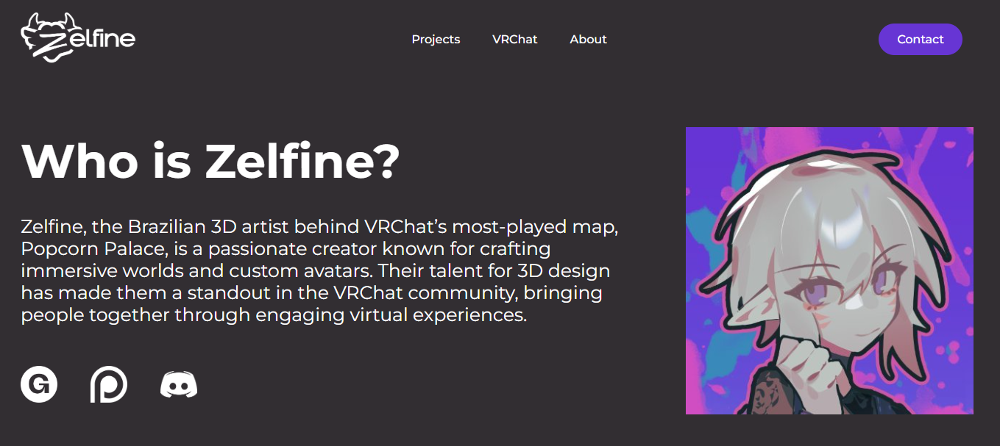
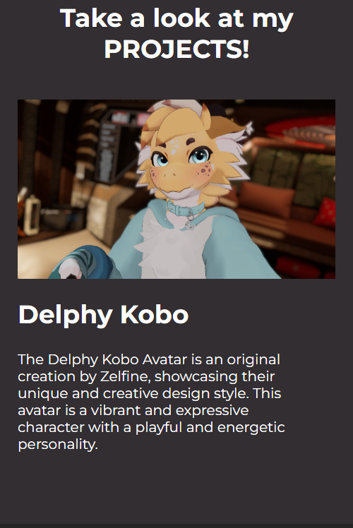

# Responsive Website for 3D Artist made in HTML and CSS

## A enterprise website for an talent 3D Artist callled Zelfine!

This Website is online presence for my friend and talented 3D Artist Zelfine. On this project, you can check some of
the Zelfine's Creations and find his social media links. The website have:

* A responsive design build with pure CSS
* Great UI and UX Interface
* All the needed information about Zelfine

## Desktop Preview


## Mobile Preview


# Installation

To run this project locally, follow these steps:

Clone the repository:

```console
Copy
git clone https://github.com/your-username/zelfine-website.git
Navigate to the project directory:
````

```console
Copy
cd zelfine-website
Install dependencies (if applicable):
```

```console
Copy
npm install
Start the development server:
```

```console
Copy
npm run dev
Open your browser and visit http://localhost:3000 to view the website.
```

## Usage
This website is designed to be a static or dynamic platform for Zelfine. It can be used to:

Showcase Zelfine's products or services.

Provide contact information and support.

Share updates, blogs, or news (if applicable).

[Add any other specific use cases.]

Contributing
Contributions are welcome! If you'd like to contribute to this project, please follow these steps:

Fork the repository.

Create a new branch for your feature or bugfix.

Commit your changes.

Push your branch and submit a pull request.

Please ensure your code follows the project's coding standards and includes appropriate documentation